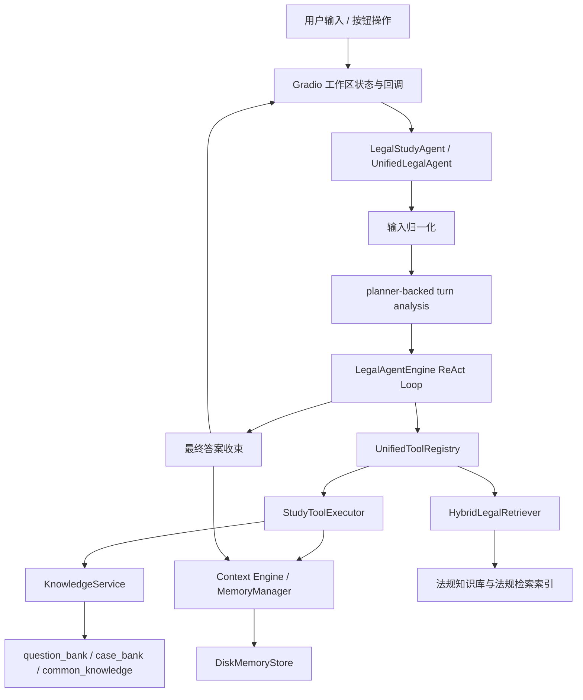
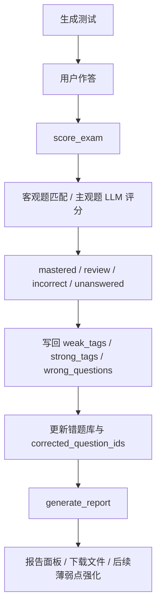

# Poster 系统工作流说明（按当前实现重写）

## 0. 先说清楚两个边界

1. 这份文档只描述当前仓库里真实存在、且我已经核对过的实现链路，不把 README 中的理想愿景直接当成既成事实。
2. 当前前端不是 React，而是 Gradio Blocks。你如果要画“前端逻辑图”，应该按 Gradio 的组件状态、回调函数和事件流来画；如果 poster 文案里必须出现“前端状态管理”，也应写成“Gradio 状态驱动工作区”。

## 1. 系统一句话概括

当前系统不是“一个大模型 + 一个 RAG”的简单问答链，而是一个由 Gradio 工作区、UnifiedLegalAgent、planner-backed turn analysis、ReAct 工具循环、Context Engine、学习知识 RAG、法规检索 RAG、出题评分报告工具链共同组成的法律学习 Agent。

## 2. 当前离线资源状态

这次重建后，线上学习资产已经更新为：

1. question_bank.jsonl：156596 条。
2. case_bank.jsonl：135560 条。
3. common_knowledge.jsonl：24 条。
4. system_seed_memories.json：9 条。
5. question_bank 题型分布：single_choice 8177，short_answer 75736，case_analysis 72683。

这意味着：

1. 当前题库已经不再是旧版那种“几乎没有案例题”的状态。
2. common knowledge 之前只有 1 条，确实过少；现在已经补到 24 条。
3. 当前题库已经能保留 DISC-Law 的原始题型，不再把无法可靠解析的题目强行压成单选。

## 3. 离线构建链路

### 3.1 DISC-Law 到学习知识资产

学习资产的生成主函数是 legal_agent.data.study_knowledge.prepare_study_knowledge_assets。

它的工作顺序是：

1. 读取 data/disc_law/disc_law_normalized.jsonl。
2. 从 DISC-Law 中提取 question candidates 和 case candidates。
3. 判断题型。
4. 生成 question_bank、case_bank、common_knowledge 和 system_seed_memories。

当前版本的关键规则是：

1. 只有题干中能稳定解析出 A/B/C/D 选项时，才保留为 single_choice。
2. 对 exam 任务族里那些没有可靠选项结构的样本，不再伪造 single_choice，而是改成 short_answer。
3. 对 jud_read_compre、judgement_predit、sim_case_match、leg_case_cls、jud_doc_sum 等案例型任务，优先归类为 case_analysis。
4. 对只有案情事实、但缺少完整提示语的题目，会自动补全成“请阅读以下案情，结合法律规定进行案例分析并作答：”这一类完整题干。

### 3.2 法规语料到法规检索索引

法规链路和学习题库链路是并行的。

1. 本地法规文件先经过解析、切块和清洗。
2. 再由法规检索模块构建面向 retrieve_from_kb / lookup_statute 的法规知识底座。
3. 这条链路负责法条、效力层级、地区适用和法规标题定位。

## 4. 在线系统总结构

在线主链可以拆成七层：

1. Gradio UI 工作区层。
2. LegalStudyAgent 统一入口层。
3. planner-backed turn analysis 输入理解层。
4. LegalAgentEngine ReAct 执行层。
5. UnifiedToolRegistry 工具调度层。
6. MemoryManager / KnowledgeService / HybridLegalRetriever 数据层。
7. 报告与记忆写回层。

如果你画 poster 主图，建议就按这七层自上而下画。

## 5. 前端工作流真实实现

### 5.1 前端入口

前端入口分成两层：

1. legal_agent.web.app：负责创建 Blocks、主题、CSS 和 launch 参数。
2. legal_agent.web.unified_workspace：负责真正的工作区状态、回调函数和组件交互。

### 5.2 工作区状态对象

统一状态对象包含：

1. user_id
2. session_id
3. pending_root_question
4. pending_question
5. clarification_answers
6. trace
7. report_markdown
8. report_path
9. last_assistant_message
10. live_status

这说明前端不是“只保存聊天消息”，而是显式维护：

1. 当前用户/会话是谁。
2. 当前是否处在追问补充阶段。
3. 当前报告、trace 和最近回复是否要同步刷新到面板。

### 5.3 聊天提交流程

聊天发送按钮走 _submit_chat，流程如下：

1. 先调用 _refresh_workspace_data，同步当前用户、会话、历史消息、报告状态和工作区状态。
2. 如果用户输入为空，前端直接返回提示，不进入 agent。
3. 根据模型下拉框解析 model_path 和 adapter_path。
4. 根据 runtime_device 解析 retrieval_device 和 model_device。
5. 如果当前 state 里存在 pending_question，说明上一轮是在等待用户补充事实。
6. 这时 _compose_followup_question 会把“原始问题 + 已追问内容 + 本轮补充答案”拼成一个新的运行时问题。
7. UI 先显示一条中间状态：“已接收问题，正在规划下一步。”
8. 然后调用 agent.handle_message。
9. 如果 agent 返回 needs_user_input=True，则把 clarification_question 写回 pending_question，等待下一轮补充。
10. 如果 agent 已完成回答，则清空 pending_root_question、pending_question 和 clarification_answers。

### 5.4 出题按钮与报告按钮

除了聊天框，还有两条确定性按钮链路：

1. _run_exam_action：直接调用 agent.generate_exam。
2. _run_report_action：直接调用 agent.generate_report_response。

这两条链路绕过自然语言歧义，更适合稳定 UI 操作。

## 6. 用户消息进入 Agent 之后发生了什么

UnifiedLegalAgent.handle_message 的核心顺序是：

1. 确保 user/session 存在。
2. 绑定 memory reasoner。
3. 调用 _normalize_runtime_question 做输入归一化。
4. 读取最近会话历史。
5. 通过 _build_engine 构造 LegalAgentEngine。
6. 调用 engine.run 执行。
7. 把最终 answer、tool_history、trace、report_path 等信息统一写回 memory。

其中 _normalize_runtime_question 的作用是把一些容易歧义的输入先规整成“同一任务下的可执行问题”，例如：

1. 聊天框里直接提交答题卡。
2. 用户输入实际上是在回答上一轮追问，而不是开启一个新问题。

## 7. 当前 planning 是怎么落地的

### 7.1 现在已经启用了 planner-backed turn analysis

当前版本里，UnifiedLegalAgent._build_engine 会显式传入 use_planning_engine=True。

这意味着 LegalAgentEngine 初始化时会创建 StudyPlanner，并在 _initial_state 里调用 planner.analyze_turn 输出结构化 turn analysis。

### 7.2 turn analysis 会输出什么

它至少会输出：

1. current_input_role
2. user_goal
3. needs_history
4. requires_precise_result
5. likely_missing_info
6. recommended_next_step
7. should_ask_user
8. clarification_priority
9. intent
10. clarification_question

这些信息不会直接展示给用户，而是作为 ReAct 决策约束。

### 7.3 当前 planner 的关键策略

1. 出题请求默认题型已经从 single_choice 改成 mixed。
2. legal_qa 的推荐优先动作已经从 memory_search 改成 prepare_context。
3. followup_answer 的推荐优先动作是 rag_search。
4. 只有缺失事实真的会改变结论时，should_ask_user 才应该为真。

## 8. ReAct 状态机如何工作

LegalAgentEngine 的在线循环是：

1. 构造 system prompt、历史对话、turn analysis 和 scratchpad。
2. 让模型输出两种格式之一：
   1. Thought + Action
   2. Final Answer
3. 解析输出。
4. 对 Action 做工程化后处理。
5. 执行工具并把结果写回 scratchpad。
6. 继续下一轮，直到收束。

## 9. 为什么这次修改能抑制重复追问

现在的追问控制是四层门禁：

1. planner 先给出 should_ask_user 和 recommended_next_step。
2. _postprocess_parsed_step 先规范 ask_user 的问题文本和 field_name。
3. 如果 planner 已经判断“不该继续追问”，而模型仍输出 ask_user，则引擎会把这一步改写为：
   1. prepare_context
   2. rag_search
   3. retrieve_from_kb
   中更合理的一步。
4. 如果已经追问过、用户也补充了关键事实、同时已有针对性检索结果，则会直接收束为 final answer，不再追加追问。

对于补充事实类输入，系统还会把“原问题 + 新补充事实”重新拼回同一个检索 query，避免只拿最后一句补充去搜。

## 10. 工具层如何分工

UnifiedToolRegistry 同时暴露两类工具。

### 10.1 学习工具

由 StudyToolExecutor 提供：

1. prepare_context
2. memory_search
3. profile_upsert
4. profile_view
5. rag_search
6. calculator
7. generate_exam
8. score_exam
9. generate_report
10. ask_followup

### 10.2 法规工具

由 ToolRegistry / HybridLegalRetriever 提供：

1. retrieve_from_kb
2. lookup_statute
3. resolve_hierarchy
4. calculator
5. ask_user

### 10.3 工具调用顺序应该怎么理解

当前最合理的理解是：

1. 先 prepare_context，把画像、历史和长期记忆整理出来。
2. 学习场景优先用 rag_search 查题库、案例库和 common knowledge。
3. 需要现行法规依据或地区适用判断时，再用 retrieve_from_kb / lookup_statute。
4. 只有缺失事实真的会改变结论时，才 ask_user。

## 11. Context Engine 是整个系统的骨架

MemoryManager 不是简单保存聊天文本，而是维护结构化记忆，包括：

1. profile
2. session turns
3. episodic memories
4. semantic memories
5. long-term memories
6. summary memories
7. system memories
8. memory graph

每轮结束后，record_turn 会把这一轮对话和工具结果写成结构化记忆，并支持后续压缩和关联检索。

prepare_context 则会把：

1. 长期画像
2. 当前会话摘要
3. working memory
4. long-term hits
5. session hits
6. system hits
7. guaranteed hits
8. related hits

整理成 planning_context 和 summary_blocks，再供 planner、ReAct 或 direct tool path 使用。

## 12. RAG 实际上有两条检索面

### 12.1 学习知识 RAG

KnowledgeService 面向学习场景，主要使用：

1. question_bank
2. case_bank
3. common_knowledge

它负责 rag_search、sample_questions 和 build_exam_questions。

### 12.2 法规检索 RAG

HybridLegalRetriever 面向法规依据场景，负责：

1. retrieve_from_kb
2. lookup_statute
3. resolve_hierarchy
4. 地点解析
5. 法效层级与地区适用判断

### 12.3 为什么必须画成双 RAG

因为学习问题和法规依据问题不是同一个检索面：

1. 学习型问题更适合查题库、案例和答题知识。
2. 法规依据型问题更适合查法条、标题、效力层级和地方适用范围。

## 13. 出题链路

出题可以从两条路径进入：

1. UI 按钮直接触发 generate_exam。
2. 自然语言里出现“出题 / 模拟测试 / 来一套题”等意图，再被识别后进入 generate_exam。

generate_exam 的真实顺序是：

1. 读取用户画像。
2. 组合 preferred_tags = weak_points + study_goals。
3. 读取 wrong_question_bank。
4. 默认 question_types 现在是 mixed，而不是 single_choice。
5. 调用 KnowledgeService.sample_questions。
6. 调用 build_exam_questions 做结构校验和渲染。

### 13.1 当前错题回放策略

这一版已经改成：

1. 只有 exam_type == 薄弱点强化 时，才优先回放 wrong_question_bank。
2. 综合练习、章节练习和真题模拟会主动避开错题库回放，不再随机把旧错题混进普通训练。

### 13.2 为什么现在题型更合理

原因有两层：

1. 题库构建阶段已经保留了原始题型。
2. 调用层默认也不再只请求 single_choice。

所以当前实际效果是：

1. 不显式指定题型时，默认混合出题。
2. 显式选“单选题 / 简答题 / 案例分析题”时，再按指定题型采样。
3. 案例题题干保持完整，不再只剩半句案情。

## 14. 评分链路

score_exam 的顺序是：

1. 解析答题卡。
2. 逐题判断 question_type。
3. 客观题走选项归一化匹配。
4. 主观题优先走 subjective_exam_grader，也就是 UnifiedLegalAgent._grade_subjective_exam。
5. 如果 LLM 评分失败，再退回 fallback heuristic grader。
6. 最后统一落到四类分类：mastered、review、incorrect、unanswered。

### 14.1 错题写回规则

这条规则已经满足“基本正确不要进错题库”的要求：

1. mastered：不进错题库。
2. review：记为待巩固，也不进错题库。
3. incorrect：才写入 wrong_questions。
4. 如果某题过去在错题库里，但本次达到 review 或 mastered，则会进入 corrected_question_ids，后续用于从错题库移除。

## 15. 报告链路

generate_report 的流程是：

1. 从 MemoryManager.build_report_snapshot 读取当前画像、最近测试、弱项、强项和错题信息。
2. 渲染 markdown 报告。
3. 同时保存 markdown 和 json 快照到 reports/user_reports/<user>/。
4. 把 report_path 写回 session state。
5. UI 右侧报告面板与下载入口同步刷新。

## 16. 你在 poster 上最值得画的四条主路径

### 16.1 正常问答路径

用户输入
-> Gradio _submit_chat
-> LegalStudyAgent.handle_message
-> UnifiedLegalAgent.handle_message
-> planner-backed turn analysis
-> ReAct 工具循环
-> prepare_context / rag_search / retrieve_from_kb / ask_user
-> final answer synthesis
-> record_turn + memory 更新
-> UI 聊天区刷新

### 16.2 出题路径

出题按钮或出题意图
-> generate_exam
-> 读取画像
-> prepare_context
-> sample_questions
-> build_exam_questions
-> 写入 active exam session
-> 聊天区和工作区状态刷新

### 16.3 评分路径

答题卡输入
-> score_exam
-> 客观题匹配 / 主观题 LLM 评分
-> mastered / review / incorrect / unanswered 分类
-> weak_tags / strong_tags / wrong_questions 写回
-> 生成复盘信息

### 16.4 报告路径

报告按钮或报告意图
-> build_report_snapshot
-> 渲染 markdown 报告
-> 保存 markdown/json
-> 更新 last_report_path
-> 报告面板刷新

## 17. 推荐直接放进 poster 的两张图

### 17.1 在线主链图

### 17.2 测试与报告闭环图

## 18. 如果你要强调这次系统改进，最值得写的六点

1. 题库已按 DISC-Law 全量重建，并保留原始题型，不再把无法可靠解析的题目强制改写成单选题。
2. 案例分析题会自动补足完整题干提示语，减少残缺题面。
3. 默认出题策略从“单选优先”改成“混合题型”。
4. 错题回放只在“薄弱点强化”模式触发，普通练习不再随机混入错题。
5. 主观题评分采用“LLM 优先、启发式兜底”的双层评分，并把基本正确回答归为 review 而不是错题。
6. planner-backed turn analysis 与 ReAct 后处理共同抑制重复追问，在信息足够时优先改写为上下文整理或检索动作。

## 19. 最后一句给你画图时的口径建议

如果你要把系统画得既真实又完整，最稳妥的口径不是“一个大模型 + 一个 RAG”，而是：

“一个由前端状态机、planner-backed ReAct 推理链、Context Engine 记忆层、双检索面、出题评分报告工具链和持久化学习闭环共同组成的法律学习 Agent。”
